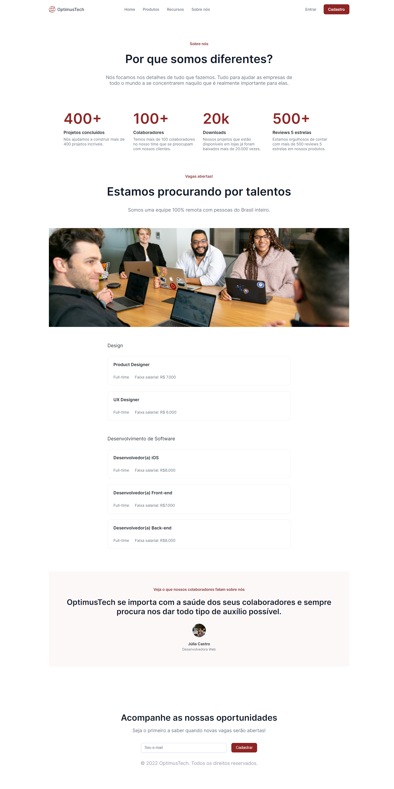

  <h1 align="center"> 7DaysOfCode | HTML e CSS OptimusTech (Página de Vagas)</h1>

  

  Projeto 7DaysOfCode, promovido pela Alura.
  

  

    <a href="#-tecnologias">Tecnologias</a>&nbsp;&nbsp;&nbsp;|&nbsp;&nbsp;&nbsp;
    <a href="#-projeto">Projeto</a>&nbsp;&nbsp;&nbsp;|&nbsp;&nbsp;&nbsp;
    <a href="#-layout">Layout</a>&nbsp;&nbsp;&nbsp;|&nbsp;&nbsp;&nbsp;
  

  

    
  

   
   
  

## 🚀 Tecnologias

Esse projeto foi desenvolvido com as seguintes tecnologias:

- HTML, CSS
- Git e Github

## 💻 Projeto

> 7DaysOfCode

Projeto visando a prática de conhecimentos em HTML e CSS.

## 🔖 Layout

Você pode visualizar o projeto através [DESSE LINK](https://felipepleao.github.io/courseProjects-rocketseat/projeto09.1--stg-04/).
